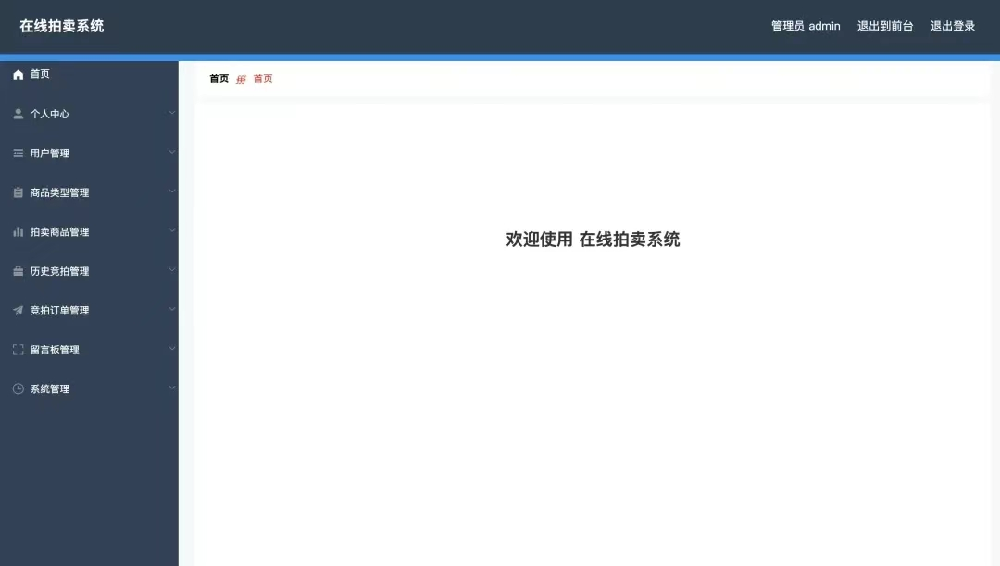

***************************************************************
关于源码项目的相关问题可以联系我们交流： 【QQ 979748385】
                                         
     
***************************************************************

系统架构

前端：html | js | css | jquery | vue

后端：springboot | mybatis

环境：jdk1.8+ | mysql | maven

使用说明
1、下载源码，导入IDEA

2、创建数据库，执行数据库脚本

3、修改数据库jdbc连接参数

4、在IDEA中运行

5、打开浏览器，参考<说明文档.txt>中的地址

***************************************************************

简介

随着社会的发展，社会的各行各业都在利用信息化时代的优势。计算机的优势和普及使得各种信息系统的开发成为必需。

在线拍卖系统，主要的模块包括管理员；首页、个人中心、用户管理、商品类型管理、拍卖商品管理、历史竞拍管理、竞拍订单管理、留言板管理、系统管理，用户；首页、个人中心、历史竞拍管理、竞拍订单管理、留言板管理，前台首页；首页、拍卖商品、竞拍公告、留言反馈、个人中心、后台管理等功能。系统中管理员主要是为了安全有效地存储和管理各类信息，还可以对系统进行管理与更新维护等操作，并且对后台有相应的操作权限。

要想实现在线拍卖系统的各项功能，需要后台数据库的大力支持。管理员验证注册信息，收集的用户信息，并由此分析得出的关联信息等大量的数据都由数据库管理。本文中数据库服务器端采用了Mysql作为后台数据库，使Web与数据库紧密联系起来。在设计过程中，充分保证了系统代码的良好可读性、实用性、易扩展性、通用性、便于后期维护、操作方便以及页面简洁等特点。

本系统的开发使获取在线拍卖系统信息能够更加方便快捷，同时也使在线拍卖系统信息变的更加系统化、有序化。系统界面较友好，易于操作。

关键词：在线拍卖系统  ；Spring Boot框架；Mysql数据库

登入

